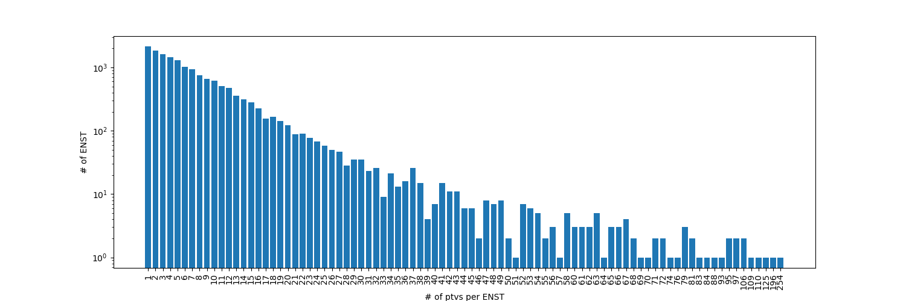
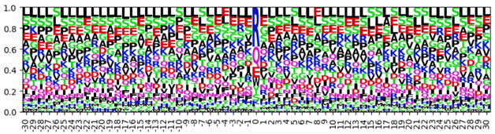
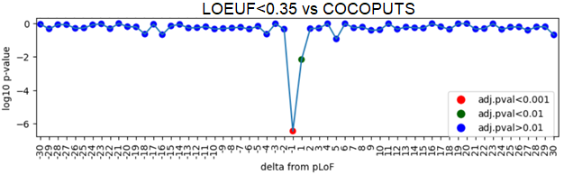
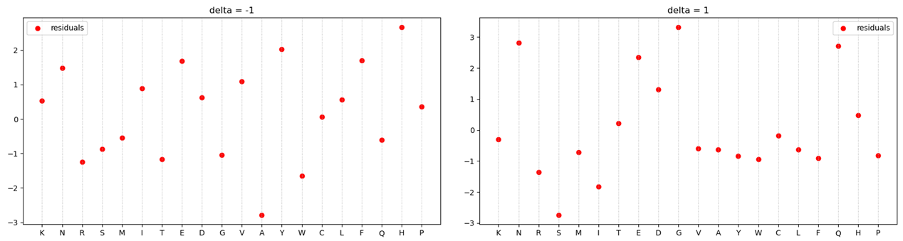

# Adding context to nonsense: analysis of sequence properties at pLoF variant sites
Source files for analyzing DNA sequence properties in regions of nonsense-mutations in human CDS.

## Table of contents
<!--ts-->
  * [Nonsense-mutations selection](#nonsense-mutations-selection)
  * [Local context construction](#local-context-construction)
  * [Baseline construction](#baseline-construction)
  * [Context analysis](#context-analysis)
  * [Authors](#authors)
<!--te-->

## Nonsense-mutations selection

Nonsense-mutation positions were selected from gnomAD v2.1.1 database lifted over to GRCh38 human reference assembly. The following criteria from Ensembl Variant Effect Predictor ([VEP](https://www.ensembl.org/info/docs/tools/vep/index.html)) were used:

- Consequence = stop_gained
- CANONICAL = YES
- LoF_flag = None
- LoF_filter = None

 

In total, 122 101 predicted transcript variants (ptvs) were found. However, the distribution of ptvs per gene is highly uneven (see figure above), so they were filtered with no more than 2 ptvs per ENST threshold. As a results, 22 901 ptvs rest.

## Local context construction

Local contexts around selected ptvs were constructed using a window of 30 codons from each side from the mutation position. Further, the genes were filtered only to conserved ones based on LOEUF<0.35 (upper bound of 90% confidence interval for observed/expected ratio for pLoF variants). As a result, the following amino acids distribution was obtained.

 

## Baseline construction

In order to obtain the baseline distribution, two approaches were used. Firstly, we manually constructed codon distribution around given codons based on CDS from the GRCh38 human genome. However, further experiments showed a high level of discrepancy when using this baseline. So we ended up utilizing codon usage distribution based on RefSeq CDS data from GWU [COCOPUTS](https://hive.biochemistry.gwu.edu/dna.cgi?cmd=tissue_codon_usage&id=586358&mode=cocoputs) 
([https://doi.org/10.1016/j.jmb.2019.04.021](https://doi.org/10.1016/j.jmb.2019.04.021)). 

## Context analysis

We performed a chi-squared goodness-of-fit test of selected context compared to the COCOPUTS baseline. P-values were adjusted for multiple testing using Benjamini–Hochberg procedure. The results show significant codons distribution differences in -1 and 1 positions relative to the mutation site.

We further investigated the amino acids' distribution at these positions. At position -1 we can see the decrease in Alanine and increase in Histidine. At position 1 the changes are not so obvious.

## Authors
**Implementation:** 

Artem Ivanov, [ITMO University](https://itmo.ru/), Saint-Petersburg, Russia.

**Supervisor:** 

Yury Barbitoff, [Bioinformatics Institute](https://bioinf.me/), Saint-Petersburg, Russia
